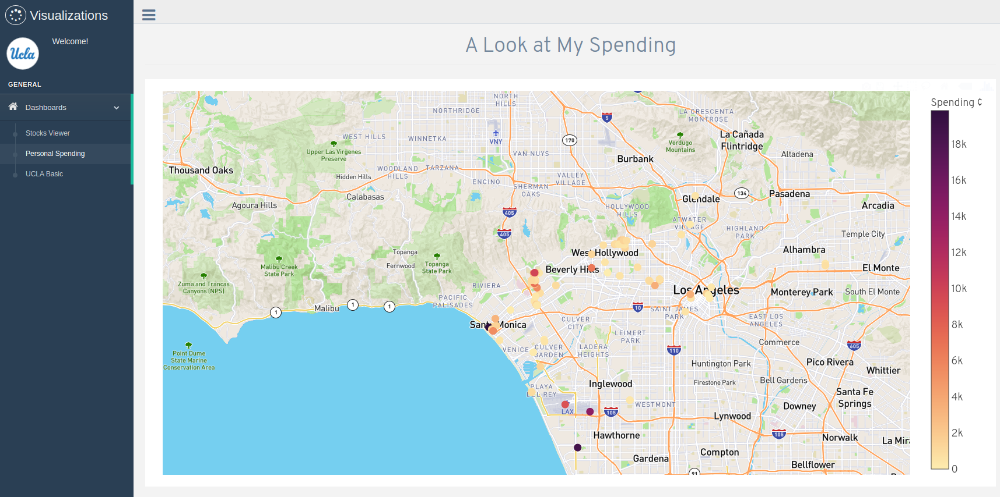
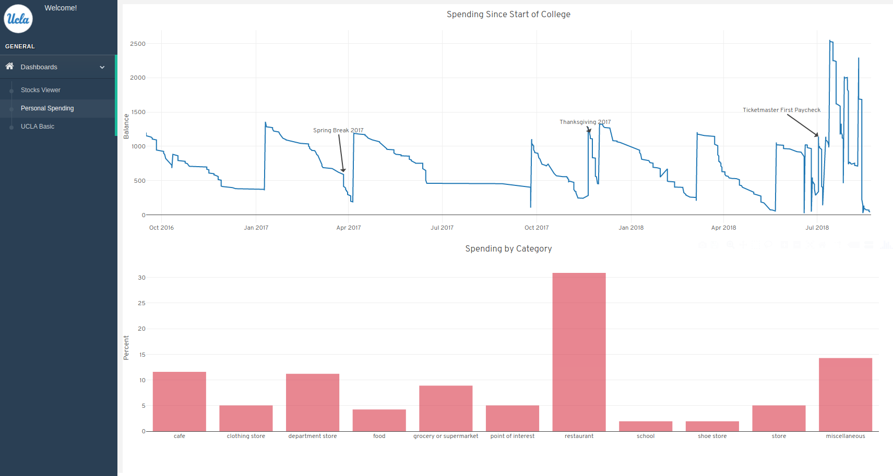

## Personal Spending Dashboard 
During my first internship I had a little money to spend. I was curious about my finances and decided to build a personal spending dashboard built. This was build using Flask as well as the gentella template with data extracted from bank statements. 

### Setup
#### Install requirements
`pip install pipenv`
`pipenv install`
`pipenv shell`

### run
`export FLASK_APP=gentelella.py`
`flask run --host=0.0.0.0`
